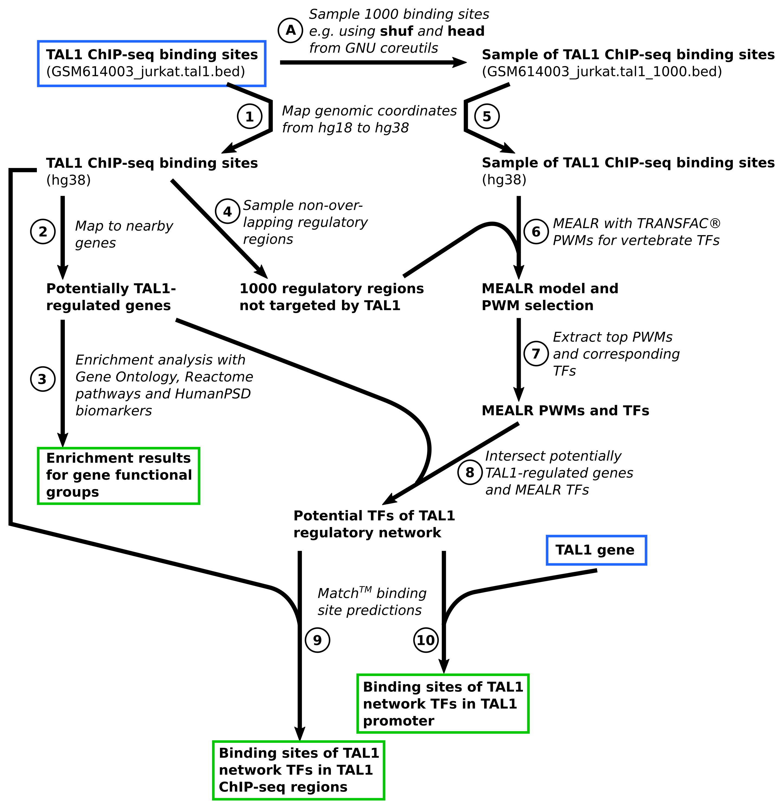

# Overview of the analysis workflow

The main tutorial example is a workflow to infer possible components of
a gene regulatory network on the basis of [ChIP-seq](https://en.wikipedia.org/wiki/ChIP_sequencing) data.
The workflow is depicted in [Figure 2](#figure-2-workflow-overview).
Starting point of the analysis is the BED file containing genomic locations
of TAL1-bound regions in Jurkat cells discovered and published by [Palii et al.](https://doi.org/10.1038/emboj.2010.342).
The [GEO repository](https://www.ncbi.nlm.nih.gov/geo/) hosts the ChIP-seq data of the study under series accession 
[GSE25000](https://www.ncbi.nlm.nih.gov/geo/query/acc.cgi?acc=GSE25000).
The tutorial focuses on the TAL1-bound genomic locations reported by the study authors
which can be downloaded [here](https://www.ncbi.nlm.nih.gov/geo/download/?acc=GSM614003&format=file&file=GSM614003%5Fjurkat%2Etal1%2Ebed%2Egz).

Source code that implements the workflow is provided for [geneXplainR](chipseq_analysis_r.md) and
[the Java API](chipseq_analysis_java.md). The corresponding JSON configuration file
for the *exec* commandline interface can be found [here](chipseq_analysis_json.md).

## Workflow steps

### Step A. Sampling TAL1 binding sites

In a preparatory step we extracted a sample of 1000 TAL1 bound regions
for subsequent MEALR analysis. The sample was drawn using the *shuf* and
*head* programs from [GNU coreutils](https://www.gnu.org/software/coreutils/).
The file *GSM614003_jurkat.tal1_1000.bed* containing the sampled sites
is part of the material for this tutorial.

### Step 1. Import and mapping of TAL1-bound genomic regions

Step 1 imports the BED file with TAL1-bound genomic regions into the
platform workspace. Since the genomic regions reported in the original
study referred to human genome sequence version *hg18*, we then use
the Galaxy tool *Lift over* to convert the hg18 coordinates to hg38.

### Step 2. Mapping TAL1-bound genomic regions to nearby genes

Step 2 assigns the hg38 coordinates of TAL1-bound regions with nearby genes using
the platform tool *Track to gene set*.

### Step 3. Functional enrichment analysis of genes near TAL1-bound regions

Genes located in the vicinity of TAL1 binding sites are analyzed for
enrichment of certain functions on the basis of [Gene Ontology](http://geneontology.org)
annotation, [Reactome](https://reactome.org) pathways, as well as for
enrichment of known human disease biomarkers annotated in the [HumanPSD](https://genexplain.com/humanpsd/).
This is done using the *Functional classification* platform tool.
Please note that the HumanPSD biomarker resource requires a license.

### Step 4. Sampling genomic regions not bound by TAL1

MEALR requires a background set of genomic regions to find a discriminating
pattern of PWM scores. The platform tool *Create random track* samples
regions around transcription start sites of genes that do not overlap
with an input set of genomic regions, in this case the study set of
TAL1 binding sites, and with the same length distribution.

### Step 5. Import and mapping of TAL1 binding site subset

The set of TAL1 binding sites sampled in [Step A](#step-a-sampling-tal1-binding-sites) represents the target
set of genomic regions which we import and convert to hg38 coordinates as 
in [Step 1](#step-1-import-and-mapping-of-tal1-bound-genomic-regions).

### Step 6. Selection of important PWM models using MEALR

The target and background set of genomic coordinates prepared in the previous
two steps are analyzed with *MEALR (tracks)* using TRANSFAC&reg; PWMs from the 
profile *vertebrate_human_p0.05_non3d*.
This profile contains PWM models defined for vertebrate transcription factors
omitting those that have been derived theoretically on the basis of molecular
structures of protein-DNA complexes using [3DTF](https://doi.org/10.1093/nar/gks551).

### Step 7. Extraction of binding transcription factors

Possible co-binding factors are obtained by firstly selecting the top 50 PWMs
with positive model coefficients using the *Select top rows* tool followed
by extracting corresponding transcription factor genes using the
*Matrices to molecules* tool.

### Step 8. Intersection of potentially TAL1-regulated genes and MEALR TFs

The gene regulatory network workflow is completed by intersecting the
transcription factors identified by MEALR with potentially TAL1-regulated
genes ([Step 2](#step-2-mapping-tal1-bound-genomic-regions-to-nearby-genes)) using
the *Venn diagrams* tool. The resulting set of transcription factors are inferred to
be both regulatory targets of TAL1 as well as co-regulators.

### Step 9. Prediction of binding sites of identified TFs in TAL1-bound genomic regions

In order to conduct the last two steps of the tutorial workflow we prepare
a list of PWMs representing TFs identified in Step 8 and, after its import into
the platform workspace, create a corresponding PWM profile using the
*Create profile from site model table* tool. The score cutoffs are
taken from the *vertebrate_human_p0.001_non3d* profile which adjusts
scores to a *p*-value of 0.001 estimated for a sequences with the same dinucleotide
composition as human promoter regions.
The profile for *GRN transcription factors* is then used to predict precise
binding locations of these transcription factors within TAL1 ChIP-seq regions using the
*TRANSFAC(R) Match(TM) for tracks* tool.

### Step 10. Prediction of binding sites of identified TFs around TAL1 transcription start site

Binding sites for inferred TFs are furthermore predicted in the genomic region around the
TAL1 transcription start site. As the study ChIP-seq regions did not contain a
TAL1-bound region near the TAL1 gene, we import a simple table containing the TAL1
Ensembl id and extract the region around the TSS using the *Gene set to track* tool,
followed by Match analysis of the sequence as in Step 9.

## Figure 2. Workflow overview

## Scientific results of the tutorial workflow

According to the output table named *MEALR_positive_coefficients* MEALR
assigned highest coefficients to TAL1 PWM models (V$TAL1_05 and V$TAL1GATA1_02).
and binding factors of important PWMs, such as Runt and GATA motifs, coincide 
with those reported in the [original publication](https://doi.org/10.1038/emboj.2010.342).
The TAL1-regulatory network inferred by the workflow includes the transcription 
factors ERG, GATA2, LEF1, MAX, MYB, RUNX1, RUNX2 and TCF7. GATA2, TAL1 and ERG have been
reported as components of a regulatory circuit by [Thoms et al.](https://doi.org/10.1182/blood.2020009707).
The regulatory link between RUNX1 and MYB in leukemia has been
described by [Choi et al.](https://doi.org/10.1182/blood-2017-03-775536) and
the importance of MYB for leukemic pathology has been elaborated on by [Zuber et al.](https://doi.org/10.1101/gad.17269211).
