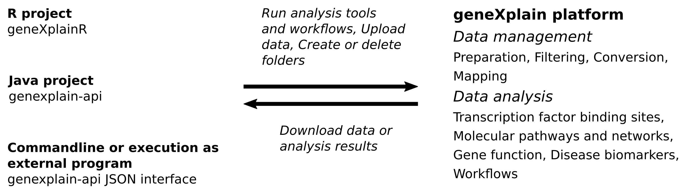

# The geneXplain platform

The [geneXplain](http://genexplain.com) platform provides a comprehensive environment to analyze 
biomedical and biological data. Its functionality includes, among other things, data storage, 
data management, data sharing, running bioinformatics and systems biology analysis tools, building 
and running analysis pipelines and workflows, building and visualizing molecular network models, 
or developing quantitative models and simulation. More details about the platform can be found 
[here](http://genexplain.com/genexplain-platform/) and in corresponding 
[research articles](http://genexplain.com/publications/).


## Interfaces of the geneXplain platform

The platform can be used through a [graphical web interface](https://platform.genexplain.com) or
through APIs that have been implemented in the languages 
[Java](https://github.com/genexplain/genexplain-api) and [R](https://github.com/genexplain/geneXplainR).
Besides being integrated as a software library, the *genexplain-api* package provides several
commandline utilities. The *exec* tool allows to configure and run remote analyses using JSON
input files. The JSON interface is described in detail in the 
[genexplain-api documentation](https://genexplain.github.io/genexplain-api/).

The [following figure](#figure-1) sketches some of the tasks that can be carried out with the platform APIs. All analysis
and utility tools provided by the geneXplain platform as well as integrated [Galaxy](https://usegalaxy.org)
tools and workflows can be executed using API functions. In addition, there are methods to
manage, organize and download research data and analysis results. Notably, analysis jobs can run
asynchronously so that one is not required to wait for long analysis tasks.

<a name="figure-1">Figure 1.</a> Overview of API tasks that can be carried out on a remote platform server.




## This tutorial

The goal of this tutorial is to demonstrate how to carry out analyses on the geneXplain platform
using the APIs with a focus on geneXplainR and the Java commandline application.

For those who would like to firstly see an example analysis, a quick start is provided [here](first_example.md).


## Platform version

The exercises shown in this tutorial use geneXplain platform version *7.0*.


## Prerequisites for tutorial exercises

1. A user account for the genexplain platform. This can be obtained 
[here](https://genexplain.com/genexplain-platform-registration/).
2. For parts requiring the Java API: Java JDK version 8
3. For parts requiring geneXplainR: R version &ge; 3.3
4. For parts that depend on analysis of transcription factor binding sites: a TRANSFAC&#174; license.
This can be obtained [here](https://genexplain.com/transfac/).
5. An API package, Java or R. Please see below how to obtain them.

We recommend obtaining the Java API package even if a user prefers R as the programming language, 
because the Java package provides a few additional utilities.


## Obtaining the APIs

The *genexplain-api* and *geneXplainR* projects are available at [GitHub](https://github.com).
Hence, there are easy ways to download the Git projects either as ZIP archives from respective
GitHub sites ([here](https://github.com/genexplain/genexplain-api) and 
[here](https://github.com/genexplain/geneXplainR)) or by cloning them using the Git `clone` tool in
a console as shown below.

```bash
# Cloning the Java API project into a destination directory named 'genexplain-api'
git clone https://github.com/genexplain/genexplain-api.git

# Cloning geneXplainR into a destination directory named 'geneXplainR'
git clone https://github.com/genexplain/geneXplainR.git
```

### Building the Java API JAR

After obtaining the genexplain-api source tree, the JAR is created using the
[Gradle build tool](https://gradle.org/).


```bash
cd genexplain-api
gradle build
```

The Gradle script creates the JAR file *genexplain-api-1.0.jar* in the *build/libs* subfolder.


### Installing geneXplainR

The geneXplainR package can be installed from its GitHub repository using the `install_github`
function of the [devtools package](https://cran.r-project.org/web/packages/devtools/index.html).

```R
# R commands to install geneXplainR
library(devtools)
install_github("genexplain/geneXplainR")
```
